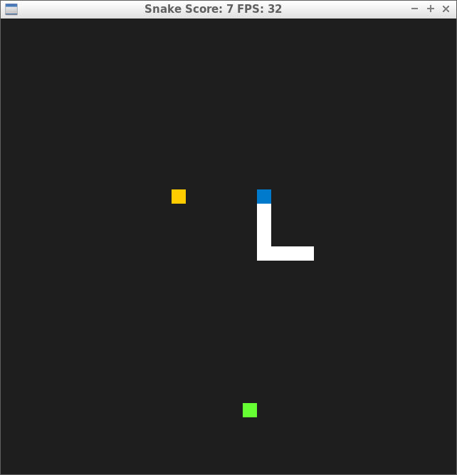

# CPPND: Capstone Snake Game Example

This is a starter repo for the Capstone project in the [Udacity C++ Nanodegree Program](https://www.udacity.com/course/c-plus-plus-nanodegree--nd213). The code for this repo was inspired by [this](https://codereview.stackexchange.com/questions/212296/snake-game-in-c-with-sdl) excellent StackOverflow post and set of responses.

The Capstone Project gives you a chance to integrate what you've learned throughout this program. This project will become an important part of your portfolio to share with current and future colleagues and employers.

In this project, you can build your own C++ application or extend this Snake game, following the principles you have learned throughout this Nanodegree Program. This project will demonstrate that you can independently create applications using a wide range of C++ features.

## Changed Game Features 
* Speed reset item

  - this item redered in green rectangle and appears in every random duration 5-25 seconds. 
  - this item reset snake's speed to inital speed.

## Dependencies for Running Locally
* cmake >= 3.7
  * All OSes: [click here for installation instructions](https://cmake.org/install/)
* make >= 4.1 (Linux, Mac), 3.81 (Windows)
  * Linux: make is installed by default on most Linux distros
  * Mac: [install Xcode command line tools to get make](https://developer.apple.com/xcode/features/)
  * Windows: [Click here for installation instructions](http://gnuwin32.sourceforge.net/packages/make.htm)
* SDL2 >= 2.0
  * All installation instructions can be found [here](https://wiki.libsdl.org/Installation)
  * Note that for Linux, an `apt` or `apt-get` installation is preferred to building from source.
* gcc/g++ >= 5.4
  * Linux: gcc / g++ is installed by default on most Linux distros
  * Mac: same deal as make - [install Xcode command line tools](https://developer.apple.com/xcode/features/)
  * Windows: recommend using [MinGW](http://www.mingw.org/)

## Basic Build Instructions

1. Clone this repo.
2. Make a build directory in the top level directory: `mkdir build && cd build`
3. Compile: `cmake .. && make`
4. Run it: `./SnakeGame`.

## Rubric Points

* Loops, Functions, I/O
  1. The project demonstrates an understanding of C++ functions and control structures.
    - All functions necessary for the snake game are managed by class, and all functions are processed in the order of input -> update -> render in the main loop.

* Object Oriented Programming
  1. The project uses Object Oriented Programming techniques.
    - Items are created and managed as classes.
    - Score class manage score using singleton pattern.
    - Game class contains all necessary components(item, snake. ...) and manage them using loop.
    
  2. Classes use appropriate access specifiers for class members.
    - All variables in item class are declared in private and other class can only access them using getter/setter functions.
    - All class except Score class can only access to score variable using AddScore() and GetScore functions
        
  3. Classes abstract implementation details from their interfaces.
    - Game class provide several function like InitItemList(), CreateItem() and all these funnctions work just like the name
    
  4. Classes encapsulate behavior.
    - Item class only provides the functions necessary for the item to work and hide internal information from the users.
    
  5. Classes follow an appropriate inheritance hierarchy.
    - ItemFood and ItemReset inherit Item class, and managed by vector of shared_ptr<Item> in game class.
 
  6. Derived class functions override virtual base class functions.
    - ItemFood and ItemReset class override Activate function from Item class.
  
* Memory Management
  1. The project uses smart pointers instead of raw pointers.
    - Item class uses shared_ptr to implement inheritance hierachy
    - Scroe class uses unique_ptr to implement singleton pattern

